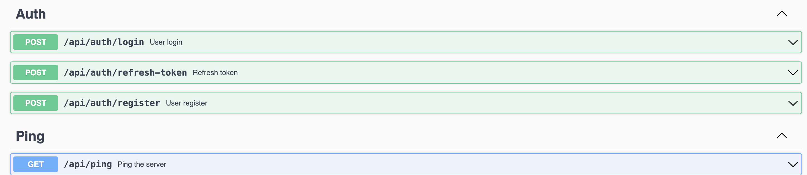
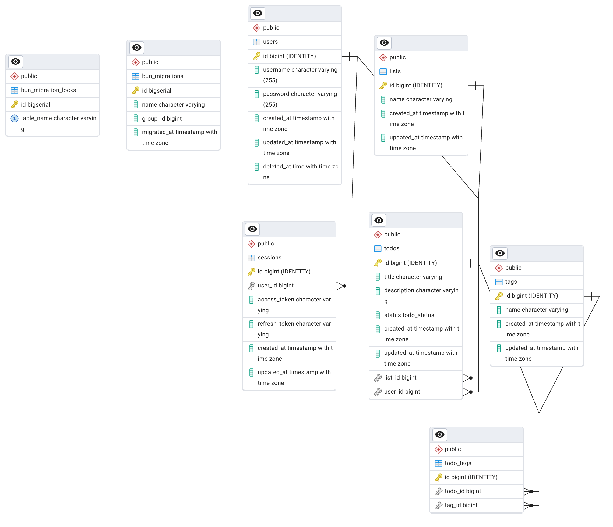

# Todo app REST API

## API Docs

See [Swagger UI](http://localhost:8080/docs/index.html)

## Endpoints



## ERD



## How to run the app

1. Clone the repo
2. Create a `dev.yml` file in `bunapp/embedded/config/` with the following configuration:

```yaml
dev: true
port: 8000

db:
  host: <host>
  port: 5432
  user: postgres
  password: <password>
  database: todo-app

jwt:
  secret: secret
  refresh_secret: refresh_secret

supabase:
  storage_uri: secret
  project_api_key: secret
  jwt_secret: secret
  contract_bucket: otp_contract_dev
```

3. Open debug in VSCode create launch configuration for the `runserver` command.

```yml
{
  // Use IntelliSense to learn about possible attributes.
  // Hover to view descriptions of existing attributes.
  // For more information, visit: https://go.microsoft.com/fwlink/?linkid=830387
  "version": "0.2.0",
  "configurations": [
    {
      "name": "Dev and Debug",
      "type": "go",
      "request": "launch",
      "mode": "auto",
      "program": "${workspaceFolder}/cmd/api-server/main.go",
      "args": ["-env=dev", "runserver"]
    }
  ]
}

```

4. Open `http://localhost:8000/docs/index.html` to see the API docs
